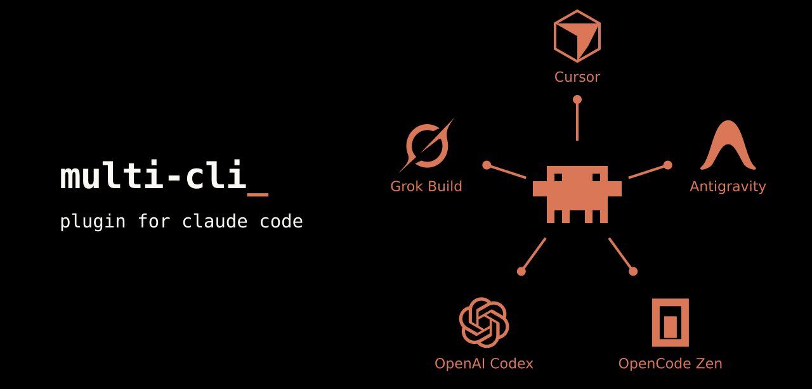

# cc-multi-cli-plugin

[](LICENSE)
[](https://github.com/greenpolo/cc-multi-cli-plugin/releases)
[](https://docs.anthropic.com/en/docs/claude-code)
[](#requirements)
[](https://github.com/greenpolo/cc-multi-cli-plugin/stargazers)

cc-multi-cli-plugin brings external models and coding harnesses into one Claude
Code session. The TypeScript gateway supports experimental OpenAI models and
the official Cursor SDK harness, and direct OpenCode Zen APIs, with Claude subscription passthrough.

The launcher uses Cursor's official SDK for native tools, persistent state and
review. Claude Code supplies the session interface and outer worker coordination;
external actions appear as attributed text/status, never executable Claude tool
calls. The callback runtime and separate Cursor reviewer have been removed.
See [the execution contract](ARCHITECTURE.md#cursor-native-execution).

## Direction: one session, multiple models and harnesses

We are building a custom Node gateway that brings external models and real coding
CLIs into Claude Code's `/model` picker and named native workers. Visible subagent
rows, elapsed time, live progress, completion, and cancellation are central to
the experience, alongside preserving each provider's supported authentication.

The direct GPT path uses Claude Code's tools and execution loop. Cursor uses
its own SDK tools and persistent execution loop. Claude or GPT parents can spawn
named Cursor workers; Cursor-native children remain disabled. Antigravity now has
an opt-in experimental native CLI bridge; other external harnesses remain planned.

Our targets are OpenAI, Cursor, Antigravity, OpenCode, local models through
llama.cpp, and Grok Build. We will maintain our adapters and reuse existing
process/session infrastructure. There is no planned replacement with a general
gateway engine or a user-facing backend choice. Future integrations will follow the same session and provider isolation rules.
[ARCHITECTURE.md](ARCHITECTURE.md) is the authoritative direction, including
current status, execution boundaries, and the first bridge milestone.

## Requirements

Node ≥ 24.12 and Claude Code. Claude login is optional for external models.
Native Cursor settings admission currently supports Linux without WSL.
Enable OpenAI with Codex's ChatGPT
login, or Cursor with the SDK login below, or both. From a checkout, run `npm install` for dependencies. `npm test`
runs type checking and offline tests. Node runs the gateway's TypeScript directly.

## Installation

### For humans

The current experimental runtime runs from a checkout. Installing the marketplace
manifest alone does not yet activate the gateway.

```sh
git clone https://github.com/greenpolo/cc-multi-cli-plugin.git
cd cc-multi-cli-plugin
npm ci
```

Connect the providers you want:

| Provider | Connect |
| --- | --- |
| OpenAI | `codex -c cli_auth_credentials_store='"file"' login` — sign in with ChatGPT |
| Cursor | `node plugins/multi-core/src/launcher.ts --cursor-login` — official SDK browser login |
| OpenCode Zen | OpenCode `/connect` → OpenCode Zen, or set `OPENCODE_API_KEY` locally |

Then launch Claude with Multi and open `/model`:

```sh
node plugins/multi-core/src/launcher.ts
```

Run the launcher by its absolute path from another project to work in that project.
Restart through the launcher after connecting a new provider. See the
[installation guide](docs/installation.md) for verification and planned marketplace setup.

### For agents

Give your coding agent this prompt alongside the repository URL or checkout:

> Install and configure cc-multi-cli-plugin using docs/installation.md in this
> repository. Check prerequisites, ask which providers I want, reuse existing
> logins, and verify the installation. Let me complete browser sign-in and enter
> any API key locally; do not ask me to paste credentials into chat.

The [agent installation instructions](docs/installation.md#for-agents) use the
same runtime and authentication paths as manual installation.

## Experimental Antigravity CLI

Use the official `agy` login, then install the scoped native permission hook:

```sh
node plugins/multi-core/src/launcher.ts --antigravity-setup
MULTI_ANTIGRAVITY=1 node plugins/multi-core/src/launcher.ts
```

This enables experimental selections and incoming workers. Claude Code's
permission mode and tool rules take precedence; native permissions are skipped
and there is no reviewer model. See [setup, permissions and
continuation limits](docs/antigravity.md). Prompt-cache reuse remains experimental.

## Development checks

Run `npm run check` for Biome formatting/lint checks, Knip unused-code analysis,
strict TypeScript checking, and the offline tests. CI runs the same command.
Use `npm run format` to format and `npm run lint:fix` for safe lint fixes;
`npm run lint` and `npm run check:unused` run the checks separately.

Biome enforces braces, single variable declarations, simple conditionals, and a
cognitive-complexity limit of 15. Explicit `any`, non-null assertions, parameter
reassignment, focused/skipped tests, and unused imports/variables are rejected.
Runtime and tests use the same rules; only the dependency lockfile is excluded
from Biome. Knip checks the active gateway, providers, tests and scripts.
See AGENTS.md for authoring and suppression rules.

The README banner is a self-contained SVG. Edit the provider list in
[`scripts/banner.mjs`](scripts/banner.mjs), then run `npm run banner:generate`.
Provider icons and spokes are laid out automatically; `npm run check` catches a
stale generated banner. See [asset editing notes](docs/assets/README.md).

## Source layout

Runtime is split into core and provider directories:

```text
plugins/
  multi-core/src/
    launcher.ts          session launcher
    gateway/             HTTP/session handling, Claude Messages, permissions
  multi-openai/src/      auth, models, Responses translation, counting, reviewer policy
  multi-cursor/src/      native SDK harness, permissions, progress and model catalog
  multi-zen/src/         API-key auth, models and Chat Completions translation
  multi-antigravity/src/ native CLI harness, permissions and model catalog
```

The launcher imports concrete gateway/provider modules. Shared Claude protocol types
live in `gateway/messages.ts`; provider credentials and catalogs stay with their
provider. Cursor currently reuses OpenAI normalization/counting helpers. Development
utilities live in root `scripts/`, with tests under `test/unit/` and `test/live/`.
This is a source-layout split. Runtime dependencies remain in the root package,
and imports between core and providers still resolve within the checkout.
Independent provider packaging, enabled-plugin discovery and the setup command
are subsequent work; this move does not activate marketplace installation.

## Experimental native OpenAI models

From a checkout, start a new Claude Code session with:

```sh
node plugins/multi-core/src/launcher.ts
```

Run `/model` to select GPT-6 Astra or GPT-5.6 Sol, Terra, or Luna as the **main
agent**. The picker retains the built-in Claude choices. Press **s** on a selected
row to switch for this session only. You can also type a model ID directly:

```text
/model multi/openai/gpt-5.6-luna
/effort high
/model sonnet
```

Typed `/model` commands and Enter in the picker save Claude Code's default for
future sessions; use **s** if you also launch ordinary Claude without this gateway.
GPT runs Claude Code's native tool loop and can delegate to the workers below.
Switching back to Claude resumes subscription-backed Anthropic requests. Text
and tool history survive switches; opaque reasoning state stays with its own
provider and is excluded from requests to the other provider. The stored
transcript is not rewritten. Any prior conversation content you continue with
GPT is sent to OpenAI as context.

Then ask: **“Use openai-luna-high to investigate this issue.”** The selected model
runs inside Claude Code's native subagent harness, with its own agent row, tool activity,
elapsed time, and completion notification. The main conversation uses the model
you select. Claude requests use the existing Claude subscription; GPT requests
use the ChatGPT login
saved by Codex (`CODEX_HOME/auth.json`, or `~/.codex/auth.json`). Sign in with
`claude` and `codex login` first. No API key is needed.

The launcher registers these workers (unsuffixed names use `medium` reasoning):

| Worker | OpenAI model |
| --- | --- |
| `openai-native` | `gpt-6-astra` |
| `openai-sol` | `gpt-5.6-sol` |
| `openai-terra` | `gpt-5.6-terra` |
| `openai-luna` | `gpt-5.6-luna` |

Append `-low`, `-medium`, `-high`, `-xhigh`, or `-max` to any worker name to choose
its reasoning level, for example `openai-sol-max` or `openai-luna-low`. These set
the native subagent's `effort`, which the gateway sends as OpenAI's
`reasoning.effort`. Main-session effort is independent. `ultra` orchestration and
arbitrary unregistered model strings are not supported. Restart through this
launcher to load newly added workers; an already-running plain Claude session
does not acquire them automatically.

The launcher starts a localhost gateway for that session and injects these
agent definitions and model-picker settings. It does not itself change global settings. Claude
requests pass through to Anthropic; only registered external worker models route to
OpenAI. Credentials stay separated. Native Claude Code permissions apply to the
worker's Read, Grep, Glob, Bash, Edit, and Write tools. Additional Claude arguments
can follow `--`, for example `-- --model opus`. Keep API-key and gateway-auth
overrides unset to retain subscription authentication.

This is an opt-in prototype, tested with Claude Code 2.1.261. It currently supports
text and native function tools, images and documents in user messages and tool
results, JSON-schema output, streamed output, encrypted reasoning continuation,
local stop sequences, and request cancellation. Image sources can be base64 (PNG, JPEG, GIF, WebP) or
HTTP(S) URLs; the gateway forwards URLs to the provider without fetching them.
The request limit is 8 MiB. OpenAI requests and native Cursor runs have no default
gateway execution deadline; Claude cancellation and explicit client timeouts still
apply. Anthropic passthrough retains a three-minute gateway timeout. Response streaming
is bounded to 32 MiB overall and 8 MiB per SSE event.
Completed Responses output can recover missing incremental text, tool arguments,
and encrypted reasoning, including the `response.done` terminal alias. Completed
items are reconciled without emitting duplicate tool calls; conflicting or
unusable output fails explicitly.
Both `output_config.format` and legacy `output_format` JSON schemas map to
Responses `text.format` with strict mode. Schemas must satisfy OpenAI's strict
subset (including required properties and `additionalProperties: false`);
the gateway preserves them unchanged rather than rewriting their constraints.
Documents support base64 PDFs and plain-text sources. URL-based documents and
provider-hosted file IDs are rejected rather than fetched or silently discarded.
Long MCP names and tool IDs use deterministic aliases; Claude receives the
original tool names. Named tool choice and discovered tool references are preserved.
Deferred custom-tool schemas are sent up front; native deferred tool search is
not emulated. Provider-side tools (such as Anthropic's hosted search/advisor) are
still unsupported; ordinary Claude-executed tools keep their normal permissions.

`/v1/messages/count_tokens` returns a local `o200k_base` estimate, including tool
schemas and heuristic media allowances, with `x-multi-token-count: estimate`.
It does not call a provider and is not an exact context or billing count.
Explicit `output_config.effort` wins. Legacy thinking budgets map approximately to
low (≤1024), medium (≤8192), high (≤24576), or xhigh; disabled thinking maps to
low because the registered models do not offer a no-reasoning level.

Stop strings are enforced locally across streamed text chunks; matching text and
later output are withheld and the upstream request is cancelled. Usage on an early
local stop is unavailable and reported as zero. The subscription endpoint does not
accept a per-request output-token cap. The gateway asks the official Codex CLI to
renew expiring ChatGPT tokens using `account/read` with `refreshToken: true`; Codex
owns OAuth and credential persistence. Keep `codex` on PATH. Concurrent requests
share renewal within the gateway. An HTTP 401 triggers at most one renewal and
retry, with an account-identity check; accepted inference streams are never
replayed. If renewal fails, run `codex login`. Credential stores that do not expose
`auth.json` are not supported yet. Grok Build workers and the llama.cpp route
are not implemented. OpenCode Zen and Antigravity have separate experimental
integrations described above.
The full built-in tool definitions are accepted, but this is not complete feature
parity: unsupported content also prevents switching an existing conversation
that contains it. Auxiliary features with incompatible schemas can still fail.
Claude currently assumes a conservative 200K context window for these custom
model IDs. The compaction contract passed on Luna with Claude Code 2.1.263:
manual and repeated compaction, automatic compaction of roughly 70K tokens,
saved-session resume, continued editing, and return to Claude. Full-window stress
and compaction inside subagents are not covered by that main-session test.
Boris Cherny has explicitly stated that using Claude Code with other models
through a proxy is supported, while noting that harness prompting and tools are
model-specific ([statement](https://x.com/bcherny/status/2086183356795060396)).

Offline checks run with `npm test`. The opt-in integration check
`node test/live/native-model-gateway.ts openai-luna-high` uses both
subscriptions to delegate a real native Read/Edit task in a temporary directory
and asserts the upstream model and reasoning level. Omit the name to test Astra
at medium effort.

`node test/live/native-openai-cache.ts` checks Astra prompt-cache reuse through
unmodified Claude with its default system prompt and full built-in tool catalog.
It reads a synthetic fixture, then resumes the saved Claude session twice with
fresh gateway instances. It expects at least 90% warm cache reuse and verifies
Claude's cached/uncached input and output totals against upstream usage. It uses
Codex login, low effort and at most six upstream requests; evidence stays in `/tmp`.
The 2026-09-08 run used four requests: the two resumed turns reused 20,480 of
20,610 and 20,651 input tokens (99.4% and 99.2%). No runtime cache change was needed.
Append `--terminal-only` to move actual completed upstream items into the terminal
output array, withhold incremental events, and verify the same native tool loop
and saved-session resumes. This also exercises endpoints that omit that array.
This establishes short-interval main-session cache reuse, not subscription-quota
charging parity with Codex, worker-cache behavior, long-idle retention, or cache
reuse after compaction/model/tool changes. Claude's dollar estimate is not a
subscription bill. OpenAI documents prefix stability and cache controls in its
[prompt caching guide](https://developers.openai.com/api/docs/guides/prompt-caching).

`node test/live/native-main-switch.ts` tests Claude → GPT main
→ native delegation → Claude in one conversation with generated fixtures.
`node test/live/native-translation.ts` tests modern and legacy
JSON schemas plus user/tool-result images against Luna, using only synthetic
fixtures and the Codex subscription. It also verifies PDF ingestion and a named
call to a long MCP tool.

`npm run test:live:compaction` runs the compaction contract against Luna, starting
with Claude history. It requires real `compact_boundary` events for two manual
compactions and one automatic compaction, checks conversation-only facts with
tools disabled, verifies a native edit after compaction, and returns to Claude.
Every turn launches a fresh gateway and resumes the same saved session by ID.
Use `npm run test:live:compaction -- openai-sol-high` to select another registered
worker, or append `--manual-only` to skip the larger automatic-trigger fixture.
The automatic case uses synthetic padding and a session-local 50K trigger
(`--autocompact 100k`, `CLAUDE_AUTOCOMPACT_PCT_OVERRIDE=50`); it is not a full-context
stress test. No global settings are changed. This opt-in check spends subscription
usage and leaves a dedicated synthetic session in Claude's normal session store.
It prints a temporary artifact directory containing the fixture, per-stage event
logs, and `report.json` with versions, routing, timings, boundary metadata, and
pass/fail status. A successful command response without a boundary fails the test.
Run it when changing a provider's history, reasoning, usage, or compaction handling.
The boundary and trigger contracts follow Claude's
[SDK command documentation](https://code.claude.com/docs/en/agent-sdk/slash-commands#compact-history-with-compact)
and [compaction environment settings](https://code.claude.com/docs/en/env-vars).

Set `MULTI_NATIVE_TRACE=1` to print routing, upstream model/effort, HTTP status, and tool-name diagnostics
without logging prompts, response bodies, or credentials. Upstream HTTP failures
preserve status and `Retry-After`, except for the single authentication retry
described above. Accepted inference is not automatically replayed by the gateway. Exit Claude normally
to stop its gateway. Plain `claude` launches independently of this experimental
launcher; use session-only model selection to keep your saved default separate.

To limit the launcher's external entries in `/model`, set `MULTI_MODELS` to a
comma-separated list of full model IDs, in your preferred display order:

```sh
export MULTI_MODELS=multi/zen/kimi-k3,multi/zen/glm-5.3,multi/zen/deepseek-v4-flash
node plugins/multi-core/src/launcher.ts
```

This works across providers: use `multi/openai/<model-id>` or the Cursor routes
shown by `--cursor-models` too. Each entry must already be available in the
launcher's picker (including any `MULTI_CURSOR_EXTRA_MODELS`); unknown or
unavailable entries fail at startup. Unset `MULTI_MODELS` restores the default
list; an empty value hides all external rows. Claude's built-in rows, named
workers and explicit/saved model selections remain available. With the filter set,
without a Claude login or an existing selection, the first visible external model
is the default.
Add the export to your shell configuration to keep the filter across launches.

## Experimental OpenCode Zen models

The shipped Zen picker defaults to DeepSeek V4 Pro and Flash, Kimi K3, GLM 5.3
and Flash, and Muse Spark 1.3 (verified September 9, 2026). These are paid Zen
API routes. Muse is included as an anticipated open-weight release; its weights
are not currently open. Other catalog models remain available through explicit
selection and named workers.

Use `MULTI_ZEN_MODELS` for a Zen-only picker filter, keeping other providers visible:

```sh
export MULTI_ZEN_MODELS=mimo-v2.5-free,ling-3.0-flash-fin-free,nemotron-3-ultra-free,nemotron-3.5-lightning-free,muse-spark-1.3-contributor-free,muse-spark-1.2-contributor-free,big-pickle
```

These seven IDs were listed with zero input/output prices on September 9, 2026;
free offers can change. The API also lists `deepseek-v4-flash-free`, but its model
metadata marks it deprecated, so it is excluded. Muse uses Responses with
low/medium/high/xhigh effort; the other free models use native Chat reasoning.
Unset the variable to restore the curated Zen defaults. `MULTI_MODELS`, if set,
further filters the combined picker.

Zen uses its direct API while Claude Code owns tools, permissions, history and
native worker execution. Connect **OpenCode Zen** through OpenCode's `/connect`,
or set `OPENCODE_API_KEY` locally, then start the existing launcher:

```sh
node plugins/multi-core/src/launcher.ts
node plugins/multi-core/src/launcher.ts --zen-models
```

The key is read from the environment or OpenCode's `opencode` API entry in
`$XDG_DATA_HOME/opencode/auth.json` (default `~/.local/share/opencode/auth.json`).
It is sent only to Zen, omitted from diagnostics and removed from the launched
Claude process's environment. No OpenCode CLI process is needed during inference.
Zen is API usage billing, separate from Codex or Claude subscription passthrough.

| Models | Route | Effort |
| --- | --- | --- |
| GPT-5.6 Luna, Terra, Sol | Responses | low, medium, high, xhigh, max |
| Kimi K2.7 Code, GLM-5.2, MiniMax-M2.7, Big Pickle | Chat Completions | Provider-native reasoning |

Select `multi/zen/<model-id>` with `/model`. Workers are named `zen-<model-id>`,
for example `zen-gpt-5.6-luna-low` or `zen-glm-5.2`. GPT workers have the advertised
effort suffixes; Chat workers have no effort variants. Claude sends an inherited
`output_config.effort` even for custom models: Chat routes leave it unapplied,
as indicated in the picker, and use provider-native reasoning. They do not claim
that `/effort` changes a model without an exposed effort setting.

Ordinary Claude tool permissions apply. With Claude access, existing native
classification remains available. Without it, Zen has no independent reviewer:
Auto is unavailable and the existing capability hook prevents a provider switch
or worker from borrowing Codex's reviewer. Users can explicitly choose Claude's
bypass mode with `-- --dangerously-skip-permissions`; the gateway never converts
Auto into bypass. OpenCode's own `--auto` approves non-denied permission requests
rather than invoking a model-based reviewer.

### Prompt caching and continuation

- Stable translated instructions, tool ordering and history preserve reusable
  prefixes. Zen's `x-opencode-session` stays stable for the Claude session,
  worker, model and gateway workspace across restarts. Responses also receives
  the same identity as `prompt_cache_key`. No random marker is added to prompts.
- Cache reads and cache writes are reported separately from fresh input tokens;
  output already includes reasoning tokens and is not counted twice. Trace mode
  (`MULTI_NATIVE_TRACE=1`) includes actual returned usage without prompt bodies.
  Claude's displayed dollar estimate for a custom model is **not a Zen bill**.
- Cache hits depend on Zen's upstream routing, expiry and model support. Switching
  to another model or compacting history can make the next request cold. The
  live check tests warm reuse separately from the first post-compaction request.
  Cancellation or an interrupted stream may leave final usage unavailable.
- Reasoning signatures belong to their Zen model and survive saved-session
  continuation. Foreign reasoning is not replayed to another provider/model;
  visible conversation history still transfers when switching. Claude owns
  compaction, so no external conversation state needs reconciliation.

The bounded catalog intentionally excludes Anthropic/Google-format Zen models.
Unsupported model IDs and media fail explicitly. GPT supports the existing
Responses image/document translation; Kimi accepts images; the other initial
Chat entries are text-only. PDF input is not supported by the Chat routes.
Local token counts are estimates, not billing measurements. Zen calls have no
implicit gateway deadline; client cancellation and explicit time limits apply.

Run `npm run test:live:zen -- --help` for the opt-in tool/cache/resume check and
optional model switching, real manual compaction and cancellation checks. It uses
synthetic fixtures, enforces an upstream request ceiling, and saves usage evidence
under `/tmp`. Inspect a failed cache report before spending usage on another run.
Current live evidence covers a real Big Pickle Read and returned cache usage;
public free-model quota blocked continuation. Authenticated GPT and the complete
warm-cache/switching/compaction matrix are not yet verified. Offline regression
coverage does not establish provider cache-hit guarantees.

## Experimental Cursor SDK harness

Sign in once through Cursor's official SDK browser flow, then launch normally:

```sh
node plugins/multi-core/src/launcher.ts --cursor-login
node plugins/multi-core/src/launcher.ts --cursor-models
node plugins/multi-core/src/launcher.ts
```

The launcher discovers models and presets available to your Cursor account. Its
compact `/model` lineup shows **Auto, Grok 4.6, and Composer 2.5**, labeled
**via Cursor**, alongside Claude and any signed-in OpenAI choices. Entries
unavailable to your account are omitted.
Auto uses the account catalog's `default` model ID and its advertised parameters.
Named workers cover base models and reasoning-only presets; other catalog models
and parameter combinations remain selectable by their full model IDs. `--cursor-models`
prints exact model IDs and any registered worker names. Ask
Claude to delegate to one of those workers, or select its model for the main
conversation. These settings belong to the launched session; the earlier note
about Claude's persistent `/model` selection still applies.

To add other Cursor models to the picker, set `MULTI_CURSOR_EXTRA_MODELS` when
launching. For example, this adds Gemini and GPT through Cursor:

```sh
MULTI_CURSOR_EXTRA_MODELS=gemini-3.8-flash,gpt-5.6-sol \
  node plugins/multi-core/src/launcher.ts
```

Choose comma-separated **`selection.id`** values from `--cursor-models`, rather
than the full `multi/cursor/...` routes. Extras appear after the three defaults;
duplicates are removed and unavailable IDs produce an explicit error. To keep
your additions across launches, export the variable in your shell profile.
Leave it unset for the default three. Restart the gateway after changing it.
This only controls picker visibility; full catalog model IDs remain usable.

The SDK login stores a named, expiring user key in `~/.cursor/sdk/auth.json`.
It is separate from Cursor's app/CLI login and uses Cursor's documented user-plan
billing. The SDK also accepts `CURSOR_API_KEY`; that key's account determines
billing. The SDK owns credential handling; the bridge never extracts private
Cursor session tokens. See [Cursor's SDK documentation](https://cursor.com/docs/sdk/typescript).

Base Cursor routes and named workers explicitly disable Fast when the catalog
advertises that parameter. Fast requires an explicit preset; it is never inherited
from the account's default variant. Our live checks use the non-Fast base routes.

Cursor executes native shell/read/edit/search tools. Task and MCP capabilities
are disabled, including ambient MCP servers. An observed external action is only
displayed in Claude Code; it is never replayed as an executable `tool_use`.

Claude's existing permission selector controls Cursor at the next prompt through
UserPromptSubmit/SubagentStart hooks. Worker modes resolve from parent inheritance
and built-in, user/project, supplied CLI or discovered plugin definitions. Unknown
workers fail explicitly. Auto requests native SDK Auto-review; its accepted fallback
when the classifier is unavailable may execute without review. Completion is not
proof of classification. Plan selects SDK plan mode with only read, grep, glob and
listing tools. Bypass selects native agent mode with Auto-review disabled, while
retaining explicit tool restrictions and the SDK's sandbox configuration. Default,
acceptEdits and dontAsk remain unsupported; there is no separate mode selector.

Worker tool lists, whole-tool deny rules and supported CLI restrictions intersect
native capabilities. Settings and plugin policies are rechecked before dispatch.
Linux managed settings and fragments support the same narrow policy translation;
unsupported managed controls, argument/path-specific rules, ask rules, permission
hooks and Claude sandbox policies fail explicitly. Unknown plugin definitions and
Cursor policy files that isolated SDK settings cannot honor also fail. macOS,
Windows and WSL policy admission remain unsupported. No policy is silently dropped.

`/effort` selects an exact advertised effort value where the model supports one;
unsupported values fail explicitly. Catalog presets retain their parameters.
Cursor's own system prompt remains active; session instructions and initial
conversation context are supplied to it.

Completed turns retain the same native SDK agent and disk state. Changed mode/tool
policy resumes that identity with the new configuration. Main sessions and workers
have separate state, guarded by kernel file locks. Worktree workers use their
hook-reported workspace for both native execution and policy checks. Identical completed requests
replay output. An interrupted gateway commit with a saved SDK run ID can recover
its terminal result through `Agent.getRun` without rerunning actions. Missing run
identity or an unreadable/nonterminal result fails explicitly and preserves state.

Outer history compaction can continue from a fresh authenticated prompt whose text
hash matches, or a unique saved-response anchor. This keeps Cursor's own history;
it does not rewind native state or replay rewritten history. Other ambiguous edits
and branches fail explicitly. Historical callback compaction tests are not native
compaction evidence.

Attributed text shows tool lifecycle, bounded sanitized edit diffs and shell output,
exit status and elapsed time. Cancellation reaches the SDK run. Arbitrary native
Claude tool cards and manual approval controls have no verified public extension
surface. Cursor-originated delegation remains deferred. The public SDK reports
natural compaction events but exposes no force-compaction or cheap threshold control.

Strict structured output, forced tool choice (including `none`), stop strings,
PDF attachments and per-response generation caps are unsupported. Images are
forwarded as SDK attachments. Token counting is a local estimate, not exact native
context occupancy or billed usage. Model-specific fidelity remains experimental.

`npm run test:live:cursor` (also `test:live:cursor-harness`) runs the bounded native
SDK tool/continuation/resume smoke check with Fast explicitly disabled. The ordinary
`npm test` suite is offline. `npm run test:live:mode-hooks` checks unmodified Claude
mode hooks against local fake responses without provider inference. Append `-- --plan`
to the Cursor check for one read-only turn. Integrated validation passed a real
Claude-parent Composer 2.5 worker edit, persisted SDK resume, cached retry,
follow-up recall and read-only Plan, all with Fast disabled. Historical callback
tests do not establish native parity. Append `-- --compact --recover` to check
outer-history continuation and terminal SDK-run recovery using the same two turns.
Both checks passed against Composer 2.5. A GPT-5.6 Luna parent also successfully
delegated a native edit to Grok 4.6 at low effort. These checks do not establish
natural Cursor compaction behavior.

Native runs have no gateway execution deadline. The launcher defaults Claude's
`API_TIMEOUT_MS` to its documented maximum `2147483647`, preserving an explicit
inherited value. OpenAI has no default gateway deadline; Anthropic passthrough
retains 180 seconds.
Claude's independent stream watchdogs and native tool limits still apply.
See [Claude environment variables](https://code.claude.com/docs/en/env-vars).

The SDK currently brings an `undici` 5.x dependency with unresolved `npm audit`
advisories. No incompatible dependency override has been applied.

## OpenAI approval and permission checks

Claude-executed OpenAI tools retain Claude's ordinary permissions. When Claude
credentials are available, native Anthropic classification passes through. Without
them, the launcher uses the authenticated OpenAI account's `codex-auto-review`
capability where available. Unsupported review actions and unavailable evidence
fail explicitly; the working model never substitutes for a reviewer.

The OpenAI reviewer uses the bundled Guardian policy and a bounded read-only
investigation loop. It receives the classification transcript, originating request,
worker root context and tool working directory. Static deny/ask rules remain with
Claude. Reviews are bounded to 60 seconds, six investigation turns and 1 MiB of
initial context; only matching second-stage denials are reused. This does not
reproduce the entire Codex reviewer harness or translate Claude's Auto prose policy.
Cursor review belongs to its native run regardless of Claude login availability.

These opt-in checks use real logins and retain temporary diagnostics:

```sh
npm run test:live:auto-mode
npm run test:live:provider-approval -- --launcher
npm run test:live:reviewer
npm run test:live:approval-worker
npm run test:live:permissions
```

The Claude/OpenAI checks exercise classifier routing and Claude-executed tool
permissions. Their historical Cursor callback cases are retired and do not prove
native Cursor enforcement. Use the native Cursor check described above for that
execution path. Native Auto availability changes across provider switches and the
full interactive permission UX remain limited by Claude's public interface.

## Historical implementation

The old slash commands, skills, companion and separate Cursor reviewer are removed.
Retained Cursor/OpenCode transports are reference modules, not selectable gateway
backends. Historical investigation lives under `.agent/archive/` and `.agent/`;
its callback compaction results and source-patch experiments are not current runtime
contracts. [The current map](docs/cursor-refactor.md) records native behavior and
remaining limitations.

## License

Apache 2.0. See [NOTICE](NOTICE) for upstream credits.
